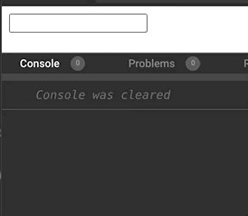

# useDebouncy

🌀Small (180 bytes) debounce effect hook for React with TypeScript support


[](https://codecov.io/gh/eavam/use-debouncy)



## Features

- 👌 **No dependencies.**
- 🏋️‍ **Tiny.** 180 bytes. [Size Limit](https://github.com/ai/size-limit) controls the size.
- 🦾 **Performance** Used by requestAnimationFrame.
- 📖 **Types.** Support TypeScript.
- 🎣 **Easy.** Like useEffect hook.

## Installation

```bash
# NPM
npm install use-debouncy

# YARN
yarn add use-debouncy
```

### [Check bit component here](https://bit.dev/eavam/use-debouncy/use-debounce)

```bash
# Import bit component
bit import eavam.use-debouncy/use-debounce
```

## Usage

### [Demo codesandbox](https://codesandbox.io/s/example-use-debouncy-ynfuq?expanddevtools=1&fontsize=14&theme=dark)

```tsx
import React, { useState } from 'react';
import useDebouncy from 'use-debouncy';

const App = () => {
  const [value, setValue] = useState('');

  useDebouncy(
    () => fetchData(value), // function debounce
    400, // number of milliseconds to delay
    [value], // array values that the debounce depends (like as useEffect)
  );

  return (
    <input value={value} onChange={(event) => setValue(event.target.value)} />
  );
};
```

## API Reference

### useDebouncy

```typescript
function useDebouncy(
  fn: () => void | (() => void | undefined),
  wait?: number,
  deps?: any[],
): void;
```

| Prop | Required | Default | Description                                                 |
| ---- | -------- | ------- | ----------------------------------------------------------- |
| fn   | ✓        |         | Debounce callback.                                          |
| wait |          | `0`     | Number of milliseconds to delay.                            |
| deps |          | `[]`    | Array values that the debounce depends (like as useEffect). |
