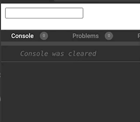

# useDebouncy

🌀 Small (~0.2kb) debounce effect hook for React with TypeScript support


[](https://codecov.io/gh/eavam/use-debouncy)
[](https://app.fossa.com/projects/git%2Bgithub.com%2Feavam%2Fuse-debouncy?ref=badge_shield)



## Features

- 👌 **No dependencies.**
- 🏋️‍ **Tiny.** ~0.2kb.
- 🦾 **Performance.** Used by requestAnimationFrame.
- 📖 **Types.** Support TypeScript.
- 🎣 **Easy.** Use like React effect or function.

## Installation

#### NPM

```sh
npm install use-debouncy
```

#### Yarn

```sh
yarn add use-debouncy
```

## Usage

### [Demo codesandbox](https://codesandbox.io/s/example-use-debouncy-ynfuq?expanddevtools=1&fontsize=14&theme=dark)

### Use as effect hook

```tsx
import React, { useState } from 'react';
import { useDebouncyEffect } from 'use-debouncy';

const App = () => {
  const [value, setValue] = useState('');

  useDebouncyEffect(
    () => fetchData(value), // function debounce
    400, // number of milliseconds to delay
    [value], // array values that the debounce depends (like as useEffect)
  );

  return (
    <input value={value} onChange={(event) => setValue(event.target.value)} />
  );
};
```

### Use as callback function

```tsx
import React, { type ChangeEvent } from 'react';
import { useDebouncyFn } from 'use-debouncy';

const App = () => {
  const handleChange = useDebouncyFn(
    (event: ChangeEvent<HTMLInputElement>) => fetchData(event.target.value), // function debounce
    400, // number of milliseconds to delay
  );

  return <input onChange={handleChange} />;
};
```

The returned function keeps the same identity across renders, so it is safe to
pass to memoized children or to a dependency array. It also carries two
controls for the call that is currently waiting:

```tsx
const save = useDebouncyFn(saveDraft, 1000);

save.flush(); // run the pending call right away
save.cancel(); // drop it instead
```

### Use as value

```tsx
import React, { useEffect, useState } from 'react';
import { useDebouncyValue } from 'use-debouncy';

const App = () => {
  const [value, setValue] = useState('');
  const search = useDebouncyValue(value, 400); // updates once typing stops

  useEffect(() => {
    fetchData(search);
  }, [search]);

  return (
    <input value={value} onChange={(event) => setValue(event.target.value)} />
  );
};
```

## API Reference

### useDebouncy/effect

```typescript
function useDebouncyEffect(fn: () => void, wait?: number, deps?: any[]): void;
```

| Prop | Required | Default | Description                                                 |
| ---- | -------- | ------- | ----------------------------------------------------------- |
| fn   | ✓        |         | Debounce callback.                                          |
| wait |          | `0`     | Number of milliseconds to delay.                            |
| deps |          | `[]`    | Array values that the debounce depends (like as useEffect). |

### useDebouncy/fn

```typescript
function useDebouncyFn<Args extends unknown[]>(
  fn: (...args: Args) => unknown,
  wait?: number,
): DebouncyFn<Args>;

type DebouncyFn<Args extends unknown[]> = ((...args: Args) => void) & {
  cancel: () => void;
  flush: () => void;
};
```

| Prop | Required | Default | Description                      |
| ---- | -------- | ------- | -------------------------------- |
| fn   | ✓        |         | Debounce handler.                |
| wait |          | `0`     | Number of milliseconds to delay. |

### useDebouncy/value

```typescript
function useDebouncyValue<Value>(value: Value, wait?: number): Value;
```

| Prop  | Required | Default | Description                      |
| ----- | -------- | ------- | -------------------------------- |
| value | ✓        |         | Value to debounce.               |
| wait  |          | `0`     | Number of milliseconds to delay. |

## Development & Testing

This project uses modern testing approach with Playwright component tests:

### Commands

```bash
# Run all tests (Playwright component tests)
yarn test

# Run tests with UI mode for debugging
yarn test --ui

# Run linting
yarn lint

# Build the project
yarn build
```

### Test Coverage

The project has comprehensive test coverage including:

- **Core functionality tests** - Basic debouncing behavior
- **Effect hook tests** - `useDebouncyEffect` scenarios
- **Function hook tests** - `useDebouncyFn` scenarios
- **Integration tests** - Real-world usage patterns
- **Performance tests** - Edge cases and performance validation
- **E2E tests** - Full application integration with API calls

All tests run across multiple browsers (Chromium, Firefox, WebKit) to ensure cross-browser compatibility.

## License

[](https://app.fossa.com/projects/git%2Bgithub.com%2Feavam%2Fuse-debouncy?ref=badge_large)
